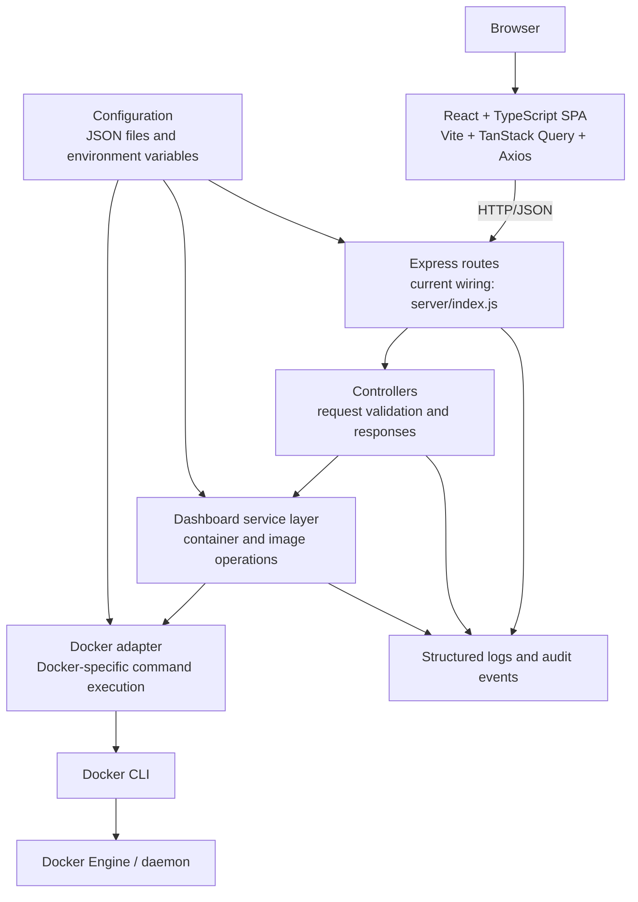
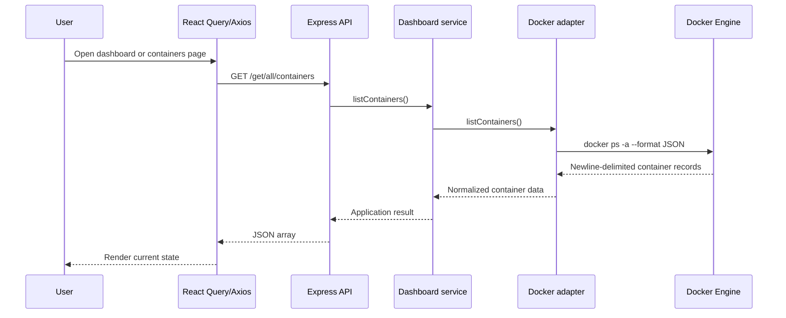
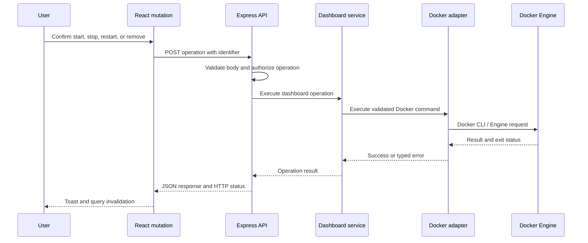

# Docker Dashboard System Architecture

## 1. Purpose and scope

Docker Dashboard is a React and TypeScript single-page application for
viewing and managing Docker containers and images. The browser communicates
with a Node.js and Express REST API. The API delegates Docker operations to a
service layer, which uses a Docker adapter to communicate with the Docker CLI
and Docker Engine.

Node.js and Express are the only backend implementation currently present in
the repository. The architecture does not maintain a second Flask runtime;
API compatibility is preserved through the existing legacy routes and the
additive `/api/*` routes.

The architecture is intentionally incremental:

- The current backend keeps route wiring in `server/index.js`.
- The Docker-facing implementation is in `server/docker/adapter.js`.
- Routes, controllers, services, middleware, errors, configuration, and Docker
  adapter modules are logical boundaries for continued extraction as the
  backend grows.
- Existing endpoint compatibility takes priority over a large rewrite.
- `docs/openapi.yaml` describes the legacy and resource-oriented API contract.

## 2. High-level architecture



The frontend must never communicate with Docker directly. Docker authority is
kept behind the API so authentication, authorization, validation, error
normalization, rate limiting, and auditing can be applied consistently.

## 3. Runtime components

### 3.1 React frontend

Location: `frontend/docker-dashboard-react/`

The frontend is a Vite-built React and TypeScript SPA.

- `src/App.tsx` defines the application shell and page routes.
- `src/pages/` contains Dashboard, Containers, and Images pages.
- `src/components/` contains layout, container, image, log, and shared UI.
- `src/api/client.ts` owns the Axios instance, base URL, timeout, and error
  normalization.
- `src/api/containers.ts`, `src/api/images.ts`, and `src/api/logs.ts` keep
  Docker operations in the API layer rather than UI components.
- TanStack Query manages server state, caching, retries, refetching, and query
  invalidation after mutations.
- `ConfigContext` manages API endpoint configuration, connection state,
  notifications, and log drawer state.

The default API base URL is `http://0.0.0.0:5000`. It can be set at build time
with `VITE_API_BASE_URL` or overridden at runtime in the UI and persisted in
browser `localStorage`.

### 3.2 Express API

Location: `server/`

`server/index.js` creates the Express application and currently contains the
route definitions, middleware registration, request validation, static-file
serving, and server startup.

The intended incremental separation is:

| Boundary | Responsibility |
| --- | --- |
| Routes | Map HTTP methods and paths to controllers with minimal logic |
| Controllers | Parse and validate requests, call services, format responses |
| Services | Implement dashboard operations without HTTP or CLI details |
| Docker adapter | Execute Docker commands and normalize command failures |
| Middleware | CORS, request IDs, authentication, authorization, limits, logging, and errors |
| Errors | Typed application errors and centralized HTTP mapping |
| Config | Environment-aware server, Docker, security, logging, and frontend settings |

Controllers should not execute Docker commands directly.

### 3.3 Dashboard service layer

The service API should expose operations such as:

```text
listContainers()
listImages()
startContainer(id)
stopContainer(id)
restartContainer(id)
removeContainer(id)
removeImage(id)
removeImages(ids)
getContainerLogs(id, options)
```

Services own application behavior and response-level concepts. They should
depend on a Docker adapter interface rather than on `child_process`, Docker
CLI argument syntax, or Express response objects.

### 3.4 Docker adapter

The implementation in `server/docker/adapter.js` is the Docker-facing
boundary. It uses asynchronous `execFile` with argument arrays, which avoids
shell interpolation. The adapter boundary should be preserved so Docker CLI
execution can later be replaced with the Docker Engine API or an SDK without
changing controllers or frontend API contracts.

The adapter is responsible for:

- Building fixed Docker commands and appending validated values as arguments.
- Applying command timeouts.
- Capturing stdout and stderr safely.
- Checking exit codes consistently.
- Limiting output for operations such as logs.
- Mapping Docker failures to structured application errors.
- Avoiding raw CLI details in production responses.

## 4. Request and data flows

### 4.1 Read flow



Image listing follows the same flow with `GET /get/all/images`.

### 4.2 Mutation flow



## 5. Current and preferred API contract

The existing endpoints remain supported for frontend compatibility:

| Method | Current endpoint | Purpose |
| --- | --- | --- |
| `GET` | `/` | Serve the frontend entry document |
| `GET` | `/assets/<path>` | Serve compiled frontend assets |
| `GET` | `/get/all/containers` | List containers |
| `GET` | `/get/all/images` | List images |
| `POST` | `/logs/container` | Fetch container logs |
| `POST` | `/start/container` | Start a container |
| `POST` | `/stop/container` | Stop a container |
| `POST` | `/restart/container` | Restart a container |
| `POST` | `/remove/container` | Remove a container |
| `POST` | `/remove/image` | Remove one image |
| `POST` | `/remove/images` | Remove multiple images |

New resource-oriented routes can be introduced as additive aliases:

```text
GET    /api/containers
GET    /api/images
GET    /api/containers/:id/logs
POST   /api/containers/:id/start
POST   /api/containers/:id/stop
POST   /api/containers/:id/restart
DELETE /api/containers/:id
DELETE /api/images/:id
```

Existing routes should not be removed until all frontend consumers have
migrated. An OpenAPI document should become the source of truth for both
route generations, request bodies, response schemas, authentication, and
error status codes.

## 6. Error model

All API errors should use one stable shape:

```json
{
  "error": {
    "code": "CONTAINER_NOT_FOUND",
    "message": "Container was not found"
  }
}
```

Recommended error categories include:

```text
VALIDATION_ERROR
NOT_FOUND
DOCKER_ERROR
DOCKER_UNAVAILABLE
UNAUTHORIZED
FORBIDDEN
RATE_LIMITED
INTERNAL_ERROR
```

The API should return safe public messages and avoid stack traces, host
details, command-line arguments, or raw Docker stderr in production. Detailed
diagnostics belong in server logs correlated by request ID.

## 7. Middleware and security architecture

Express middleware should centralize cross-cutting behavior:

1. Request ID generation and response correlation.
2. JSON body-size limits and malformed-request handling.
3. Secure, allowlisted CORS configuration.
4. Authentication.
5. Authorization and role checks for destructive operations.
6. Rate limiting for API and log endpoints.
7. Request and audit logging.
8. Final error normalization.

The API can start in a simple local-development mode without external
authentication, but production deployments should:

- Place the service behind HTTPS and an authenticated reverse proxy.
- Restrict origins, networks, and exposed ports.
- Validate identifiers, log tails, and all array inputs strictly.
- Run with only the permissions needed to access Docker.
- Never expose the Docker socket or unrestricted Docker control API to
  untrusted clients.
- Record who performed destructive operations and when.

## 8. Configuration

Configuration should be grouped into logical areas and loaded from environment
variables in deployed environments:

```text
server
docker
security
logging
frontend
```

The current repository uses:

| File or setting | Responsibility |
| --- | --- |
| `application.config.json` | Bind host and port |
| `file.config.json` | Frontend build directory and entry file |
| `command.config.json` | Container and image listing commands |
| `VITE_API_BASE_URL` | Frontend build-time API URL |
| Browser `localStorage` | Runtime API URL override |

Development, test, and production profiles should be able to change bind
addresses, CORS origins, authentication, timeouts, logging, and Docker
adapter behavior without source edits. Secrets must remain server-side and
must never be exposed through the React build.

## 9. Observability and health

Structured logs should include:

```text
timestamp
requestId
method
endpoint
statusCode
duration
operation
containerId or imageId
errorCode
```

The API should provide:

- `GET /health`: confirms that the Node.js process is alive.
- `GET /ready`: confirms that required dependencies, especially Docker, are
  available.

Health and readiness responses should be small, stable, and safe to expose
through a reverse proxy or process manager.

## 10. Real-time updates

TanStack Query remains responsible for server-state caching and synchronization.
If real-time updates are needed, add a separate event path:

```text
Docker daemon
      ↓
Docker events listener
      ↓
Node.js event service
      ↓
WebSocket or Server-Sent Events
      ↓
React dashboard
```

This can publish container start, stop, restart, removal, image changes, and
status changes without replacing existing query invalidation. Live logs should
be added only where bounded streaming and access control are well defined.

## 11. Deployment topology

### Production

```text
Browser
   │
 HTTPS
   ▼
Reverse proxy
   │
   ▼
Node.js + Express
   │
   ▼
Dashboard service layer
   │
   ▼
Docker adapter
   │
   ▼
Docker daemon
```

The reverse proxy terminates TLS, restricts network access, and can provide
authentication, request limits, and access logs. The Node.js process may serve
the compiled SPA or the SPA may be hosted separately.

### Local development

```text
Browser
   ↓
Node.js + Express :5000
   ↓
Docker CLI / Docker daemon
```

## 12. Testing strategy

The architecture should be testable without requiring a live Docker daemon:

- **Unit tests:** Docker adapter, service operations, validation, error
  mapping, configuration, and utilities.
- **API tests:** every endpoint, malformed requests, missing resources, Docker
  failures, authorization, and rate limiting.
- **Frontend tests:** API failures, mutations, query invalidation, loading
  states, connection status, and error states.
- **Integration tests:** a controlled Docker test environment for command
  compatibility and end-to-end behavior.

The Docker adapter should be mockable so service and controller tests do not
invoke the host Docker daemon.

## 13. Performance and reliability

- Prefer asynchronous command execution for the server request path.
- Enforce Docker command timeouts and bounded stdout/stderr collection.
- Cap log retrieval and reject invalid or excessive tail values.
- Avoid duplicate Docker calls and unnecessary frontend refetches.
- Invalidate affected TanStack Query keys after mutations.
- Do not cache state in a way that could make destructive operations act on
  stale identifiers or statuses.
- Handle Docker unavailability as a typed dependency error.
- Keep connection and shutdown handling explicit for deployment process
  managers.

## 14. Repository map

```text
docker-dashboard/
├── application.config.json              # Current server host and port
├── command.config.json                  # Docker listing commands
├── file.config.json                     # Frontend serving configuration
├── docs/
│   ├── API.md                           # Existing endpoint reference
│   ├── openapi.yaml                     # API contract source of truth
│   └── SYSTEM_ARCHITECTURE.md           # This document
├── server/
│   ├── index.js                         # Express app and current route wiring
│   ├── docker/adapter.js                # Docker CLI adapter
│   ├── routes/                          # Future extracted route modules
│   ├── controllers/                     # Future HTTP controllers
│   ├── services/                        # Future dashboard services
│   ├── docker/                          # Future Docker adapter modules
│   ├── middleware/                      # Future shared middleware
│   ├── errors/                          # Future typed application errors
│   ├── config/                          # Future environment-aware config
│   └── utils/                           # Future shared utilities
└── frontend/docker-dashboard-react/
    ├── src/                             # React and TypeScript source
    ├── dist/                            # Built SPA
    └── package.json                      # Frontend scripts and dependencies
```

The future directories are extraction targets, not claims that empty modules
already exist. They should be introduced only when the corresponding
responsibility is moved out of the current files.

## 15. Recommended next steps

1. Extract the current Express route handlers into route and controller
   modules without changing endpoint paths.
2. Extract dashboard operations into a service module with typed results.
3. Replace direct command helpers with an asynchronous, timeout-aware Docker
   adapter.
4. Add typed application errors and centralized error middleware.
5. Add request IDs, structured logging, `/health`, and `/ready`.
6. Add authentication, authorization, rate limiting, and secure CORS for
   production.
7. Publish an OpenAPI contract and add API/integration tests.
8. Add Docker event monitoring only after the request/response path is stable.
